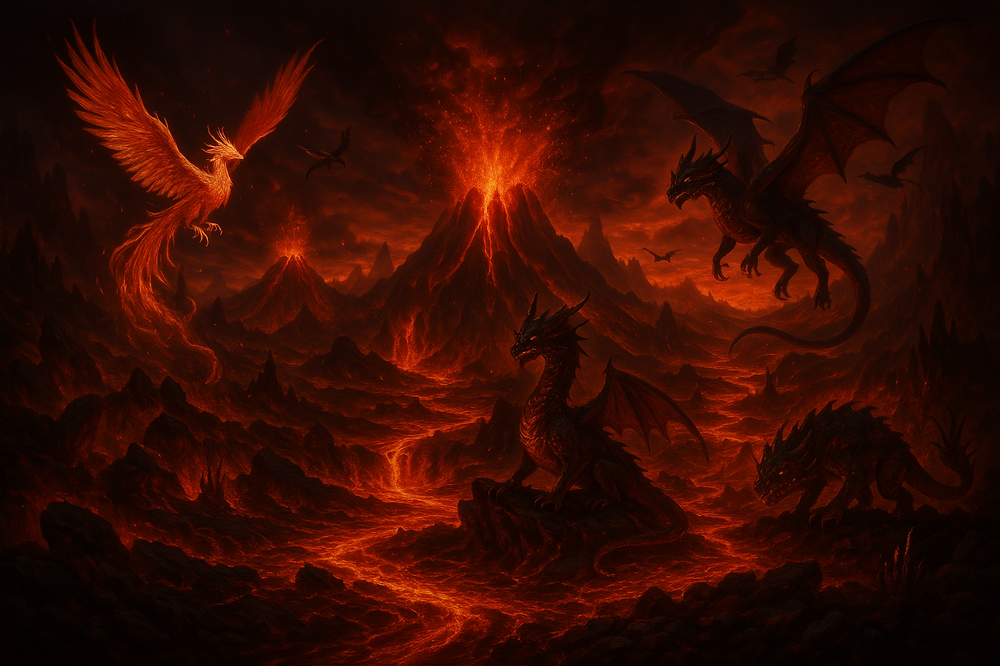

[](https://classroom.github.com/a/mi1WNrHU)

# Project C++ 🌌 ChronoCosmos

## Project Description

This project is an interactive game in which the player must make decisions based on various adventures. Situations must be resolved correctly in order to advance to the next level. Each level represents a new challenge that the player must overcome by choosing between different options. As players successfully progress through the levels, they unlock “rewards.” The ultimate goal is to complete all levels successfully and overcome the situations in each adventure.

## 🎮 Game Title 
**ChronoCosmos**

## 🌟 Theme and Setting
ChronoCosmos is a narrative adventure game that transports the player to fantastic universes. Each universe has a unique theme:

- **Nerysia**: A peaceful underwater world threatened by a dark entity.
- **Infernum**: A volcanic kingdom in danger, surrounded by threats and suffocating flames.
- **Thornia**: A world engulfed in the shadows of dark oblivion and lost memories. The player must restore balance in each universe by making key decisions that will lead them down different paths.

The player must restore balance to each universe by making key decisions that will lead them down different paths.

## 📸 Visual Resource

- 🌊 **Nerysia (Mundo de Agua)**: 
- 🔥 **Infernum (Mundo de Fuego)**: 
- ⏳ **Thornia (Mundo olvidado)**: 

These images are conceptual references to help imagine the worlds while playing.

## ⚔️ Main Mechanics
- The player enters their name and selects an adventure.
- Each adventure contains **5 levels**, each with a critical situation.
- At each level, **3 options** are presented, each with different consequences.
- If the corrcta option is chosen, the player wins a **reward**.
- Earned rewards and played adventures are stored and can be reviewed at any time.
- Adventures can only be played **once**.

## 📄 Game Rules
- Only **one person can play**
- You must choose a world to start the adventure and **cannot replay the same adventure twice.**
- Each adventure has **5 levels** 
- Each level presents a situation with only **3 available options** you must choose the best one.
- The option you choose may lead you to a different outcome **choose wisely**
- At the end of each adventure, **you can review** the visited worlds and all your progress, as well as the rewards you've earned so far.

## 🎮 Gameplay
The game is fully interactive through the console. It focuses on narrative decision-making, encouraging exploration and reasoning.

## 💡 Application of Topics Covered in Class

### ✔️ Structures
- `struct Decision`: Stores the text of the option and its consequence.
- `struct Level`: Contains the situation, decisions, reward, and the winning option.
- `struct Adventure`: Contains the name of the adventure and its levels.

### ✔️ Arreglos
- Arrays Array of decisions per level:  `Decision decisions[3]`
- Array of levels per adventure: `Level levels[5]`
- Array of rewards: `string playerRewards[20]`

### ✔️ File
- Functions to **save** and **load** progress using `ofstream` y `ifstream`.

### ✔️ Functions

**Main functions:**

- addReward()

- showRewards()

- playLevel()

- playAdventure()

- tryPlayAdventure()

- gameIntroduction()

- saveProgress()

- readProgress()

### ✔️ Modularization

- Header file (header.h): contains structure and function declarations.

- Definitions file (def.cpp): contains full implementations.

- Main file (main.cpp): controls the game.

# ⚙️  Technical Considerations

**🛠️ Dependencies**

- Lenguaje: C++

- Libraries: `<iostream>`, `<fstream>`

- No additional external libraries are required.


**💻 How to Compile**

1. You must have a C++ compiler installed, such as g++.

2. Clone this repository to your local machine, on the desktop:
   ```bash
   git clone https://github.com/FDP-01-2025/project-punto-y-coma.git

3. Locate the file in the previously cloned folder named [project-punto-y-coma]

4. Open in it Visual Sutdio Code.

5. Create a new terminal and type:
   ```bash
   g++ -o chronocosmos main.cpp

6. Run it and HAVE FUN
   ```bash
   ./chronocosmos.exe

## 🔨 Team

- **Team Name: PUNTO Y COMA** 

### ✏️ Team Members

1. **LUCIA GABRIELA NAVARRO MARIN**: 00109525

2. **HAZEL ANAHI MORALES GALVEZ**: 00050125
   
3. **GARY GEOVANNI SIBRIAN DERAS**: 00021925

4. **DANIELA BEATRIZ RAMOS PAZ**: 00113825

